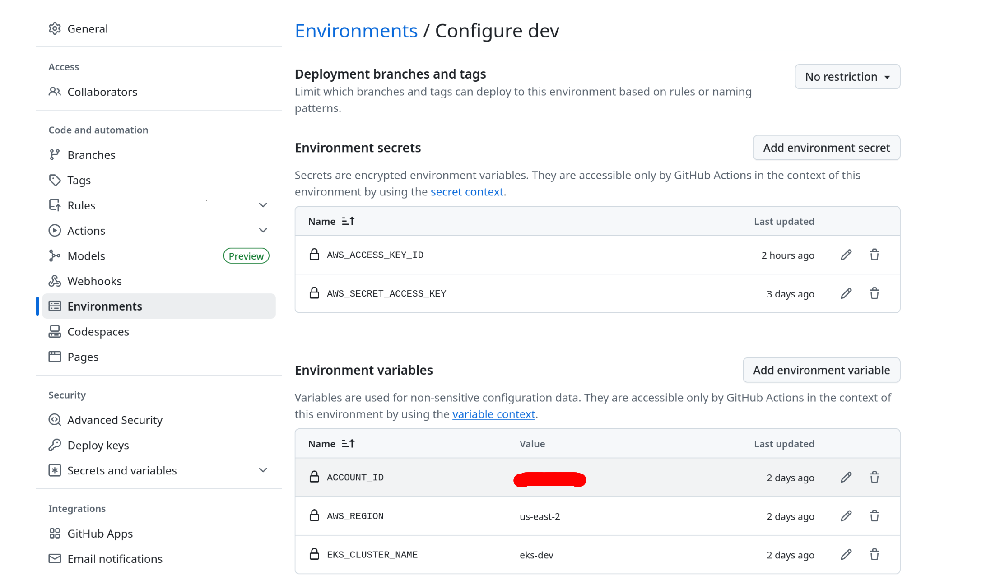

# Deployment Guide

This guide walks you through the full deployment process of the infrastructure and application in the `infra-challenge` project.

---

## Table of Contents

- [1. Create AWS Account and IAM User](#1-create-aws-account-and-iam-user)
- [2. Install AWS CLI and Configure AWS Access](#2-install-aws-cli-and-configure-aws-access)
- [3. Set GitHub Environment Variables](#3-set-github-environment-variables)
- [4. Create S3 Bucket for Remote State](#4-create-s3-bucket-for-remote-state)
- [5. Terraform Plan and Apply](#5-terraform-plan-and-apply)
- [6. Kubernetes Deployment via GitHub Actions](#6-kubernetes-deployment-via-github-actions)
- [7. Application Deployment via GitHub Actions](#7-application-deployment-via-github-actions)
- [8. Verify the App is Live](#8-verify-the-app-is-Live)
- [🌟 Alternative: One-Click Full Deployment (Recommended)](#🌟-alternative-one-click-full-deployment-recommended)

---

## 1. Create AWS Account and IAM User

1. Sign up at [https://aws.amazon.com](https://aws.amazon.com) if you don't already have an account.
2. Log in to the [AWS Console](https://console.aws.amazon.com/) and switch the region to **us-east-2 (Ohio)**.
3. Navigate to **IAM → Users → Create users**:
- Username: `github-cicd`, Next.
4. In Permissions Options, select Attach policies directly, then you have 2 options:

   ### Option A: Use the Custom Policy
   - Click **Create Policy**
   - Go to the **JSON** tab
   - Paste the contents of the policy file found in this repo path `utils/TerraformEKSFullAccess.json`
   - Click **Next**, set the name to `TerraformEKSFullAccess`, and **Create policy**
   - Return to the Set permissions options tab
   - Choose **Customer managed policies** filtering by tpe
   - Refresh the list and select `TerraformEKSFullAccess`

   ### Option B: Use AdministratorAccess (less recommended because you are adding more permissions than required)
   - Simply check the box next to the **AdministratorAccess** policy

5. Click **Next**, skip tags, review, and click **Create user**
6. Once the user is created, follow these steps to generate your **Access Key ID** and **Secret Access Key**:

   1. In the IAM console, click on the newly created user (e.g., `github-cicd`).
   2. Navigate to the **"Security credentials"** tab.
   3. Scroll down to the **"Access keys"** section.
   4. Click the **"Create access key"** button.
   5. In the wizard, select **"Command Line Interface (CLI)"** as the use case.
   6. Confirm the warning by checking **"I understand the above recommendation and want to proceed to create an access key."**
   7. Click **Next** and then **Create access key**.

🔐 **Important:**
- You will now see the **Access Key ID** and the **Secret Access Key**.
- **Download the `.csv` file** with the credentials and store it in a secure location (e.g., encrypted password manager or secure vault).
- The **Secret Access Key** will be shown only once. If you lose it, you'll have to delete the key and create a new one.

You’ll use these credentials to:
- Configure the AWS CLI using `aws configure`.
- Add them as **GitHub Secrets** to allow GitHub Actions to access your AWS resources programmatically.

---

## 2. Install AWS CLI and Configure AWS Access

Install on Linux:
```bash
curl "https://awscli.amazonaws.com/awscli-exe-linux-x86_64.zip" -o "awscliv2.zip"
unzip awscliv2.zip
sudo ./aws/install
```

Verify installation:
```bash
aws --version
```

Then configure credentials:
```bash
aws configure
```
Follow the prompts and enter your access key and secret key (obtained in step 1.6 by downloading the `.csv` file), the region (`us-east-2`), and your preferred output format (e.g., `json`).

For more details to know how to install AWS CLI you can visit this link:

https://docs.aws.amazon.com/cli/latest/userguide/getting-started-install.html

---

## 3. Set GitHub Environment Variables

First, if you haven't already, **fork this repository** into your own GitHub account. This gives you a personal copy to safely test deployments and push changes.

To fork:
1. Go to the original repository on GitHub
2. Click the **Fork** button (top right)
3. Choose your GitHub account as the destination

Now, in your forked repository:
1. Navigate to **Settings → Environments**
2. Create a new environment named `dev`
3. Inside the `dev` environment, add the following:

### Secrets:
- `AWS_ACCESS_KEY_ID` → Obtained in step 1.6 by downloading the `.csv` file
- `AWS_SECRET_ACCESS_KEY` → Obtained in step 1.6 by downloading the `.csv` file

### Environment Variables:
- `ACCOUNT_ID` → Your AWS account ID (e.g. `123456789012`)
- `AWS_REGION` → `us-east-2`
- `EKS_CLUSTER_NAME` → `eks-dev`

Github screenshot reference:



> **Hint:** Get your AWS Account ID
> 
> To retrieve your AWS account ID, run the following command:
> 
> `aws sts get-caller-identity --query "Account" --output text`
> 
> This returns your 12-digit AWS account number (e.g., `123456789012`).


Finally **Enable the Workflows**, go to Actions tab in the github repo and click on **I understand my workflows, go ahead and enable them**

### Clone Your Forked Repository

The next step is to use `git` to clone your forked copy of the repo to your local machine:

```bash
git clone https://github.com/<your-username>/infra-challenge.git
cd infra-challenge
```

## 4. Create S3 Bucket for Remote State

To avoid collisions across users or environments, generate a unique S3 bucket name using the current date:

```bash
export TODAY=$(date +%Y%m%d%H)
export BUCKET_NAME="terraform-state-$TODAY"

echo "Bucket name is: $BUCKET_NAME"

aws s3api create-bucket \
  --bucket "$BUCKET_NAME" \
  --region us-east-2 \
  --create-bucket-configuration LocationConstraint=us-east-2

aws s3api put-bucket-versioning \
  --bucket "$BUCKET_NAME" \
  --versioning-configuration Status=Enabled

aws s3api put-public-access-block \
  --bucket "$BUCKET_NAME" \
  --public-access-block-configuration '{
    "BlockPublicAcls": true,
    "IgnorePublicAcls": true,
    "BlockPublicPolicy": true,
    "RestrictPublicBuckets": true
  }'
```

Then update your backend configuration in `tf/envs/dev/backend.tf` to match the generated bucket:

```hcl
bucket = "<BUCKET_NAME>"
```

Replace `<BUCKET_NAME>` with the value of the `$BUCKET_NAME` you defined earlier.

Also you need to update github_repo variable in **tf/envs/dev/dev.tfvars** to reflect the new repository path.

Locate the `github_repo` variable:

```hcl
# tf/envs/dev/dev.tfvars
github_repo = "<your-username>/<your-repo-name>"
```

Replace it with your actual GitHub username and repository name.  
For example:

```hcl
github_repo = "pepeargento/infra-challenge-v2"
```

The last step is necessary becaues If the `github_repo` value doesn't match your actual repo path, the role will **not allow** GitHub Actions to authenticate using OIDC, resulting in errors when you can to trigger k8s deployment.

### Steps to Commit and Push Your Change

> 💡 **Best Practice**: Infrastructure changes should go through code review.


1. **Create a new Git branch:**
```bash
git checkout -b dev/update-backend-bucket
```

2. **Stage and commit your change:**
```bash
git add tf/envs/dev/backend.tf
git add tf/envs/dev/dev.tfvars
git commit -m "Update backend bucket name and github repo variable"
```

3. **Push your branch to GitHub:**
```bash
git push origin dev/update-backend-bucket
```

4. **Open a Pull Request (PR)** from the newly pushed branch on GitHub.

> 💡 **Attention**: When creating a Pull Request, make sure to compare changes using your forked repository as the base — not the original repository.  
> In the **Comparing changes** screen, set the base as `your-username/infra-challenge` and the compare branch as `dev/update-backend-bucket`.  
> ⚠️ If you don't change this, you might accidentally create the PR against the original repository instead of your own.

### Why Open a PR?

- When you open a PR, GitHub Actions will automatically run the `tf-plan-dev.yml` workflow.
- This allows you (and your team) to review the proposed Terraform changes before applying them.
- If the Terraform plan looks good, you can merge the PR into `main`, which will then trigger the `tf-apply-dev.yml` workflow (if configured).

This ensures all infrastructure updates are peer-reviewed, reproducible, and traceable.

---

## 5. Terraform Plan and Apply
Once steps 1–4 are completed, you have two options to proceed:

### Option A: GitHub Actions CI (Recommended)
- When you open a Pull Request that modifies `.tf`, `.tfvars`, or files in `tf/envs/dev`, the `terraform plan` job will run automatically.
- If the plan succeeds and shows no errors, merge the PR to main and it will apply all changes.
- On the other hand, you can trigger the `[DEV] Terraform Apply (tf-apply-dev.yml)` workflow manually (Go to Actions-> Run workflow), or wait for it to auto-run on changes pushed to main.

⚠️ Note: To force deployment in a no-change scenario, add an empty line to a any terraform config files (*.tf), commit and push the change.

### Option B: Manual Execution
Run Terraform locally to preview and apply the infrastructure:

#### ✅ Install Terraform (Generic Linux Instructions)

> 💡 **Recommended version: Terraform v1.12.1**

1. Download the binary from the official HashiCorp site:

```bash
wget -P /tmp https://releases.hashicorp.com/terraform/1.12.1/terraform_1.12.1_linux_amd64.zip
```

2. Unzip the binary:

```bash
unzip /tmp/terraform_1.12.1_linux_amd64.zip -d /tmp
```

3. Move the binary to a directory in your PATH:

```bash
sudo mv /tmp/terraform /usr/local/bin/
```


4. Include /usr/local/bin as default path or in the current shell session:

```
export PATH="/usr/local/bin:$PATH"
```

or

```
echo 'export PATH="/usr/local/bin:$PATH"' >> ~/.bashrc
source ~/.bashrc
```

4. Verify the installation:

```bash
terraform version
```

You should see something like:

```
Terraform v1.12.1
```

Then you can proceed running the plan:


```bash
cd tf/envs/dev
terraform init
terraform plan -var-file=dev.tfvars
```
If the plan looks correct:
```bash
terraform apply -var-file=dev.tfvars
```

---

## 6. Kubernetes Deployment via GitHub Actions
After provisioning the infrastructure, you can proceed to deploy Kubernetes resources (e.g., Helm charts, services, ingress) using GitHub Actions.

- When you open a Pull Request that modifies Kubernetes manifests, a plan is triggered using `kubectl diff` or `helm diff`.
- If the diff is successful, merge the PR to main and it will apply the changes
- Trigger the `[DEV] Kubernetes Apply (k8s-apply-dev.yml)` workflow manually (Go to Actions->Run workflow, or wait for it to auto-run on changes pushed to main.

⚠️ Note: To force deployment in a no-change scenario, add an empty line to a relevant .github/workflows/k8s-*.yml files or any modification in charts/ directory, commit and push the change.

---

## 7. Application Deployment via GitHub Actions
Once the infrastructure and Kubernetes resources are in place, you can deploy the application using GitHub Actions.

1. Push your Docker image to ECR (this is done automatically in the `docker-deploy-dev.yml` workflow).
2. The workflow deploys the Helm chart for the app to the EKS cluster.
3. As with previous steps, this workflow triggers automatically when you merge a PR which some changes in app/ directory or push them directly to main. Also you can enable this workflow manually **after infrastructure and Kubernetes steps have succeeded**.

---

## 8. Verify the App is Live

Once the `[DEV] Orchestrate Full Deploy` workflow finishes successfully, scroll to the step:

```
Show application URL
```

You will see an output like:

```
✅ The app is available at: http://<LOAD-BALANCER-ID>.elb.amazonaws.com
```

Copy that URL and open it in your browser. You should see a response like:

```
Hello, World! Current UTC time is 2025-06-01 18:00:00 UTC. Created by Braian
```

> 💡 This confirms that your application is deployed and reachable through Traefik.

---

## 🌟 Alternative: One-Click Full Deployment (Recommended)

Instead of steps 5, 6, and 7 — you can launch the full stack from GitHub Actions.

### 🌟 What it does:
The **[DEV] Orchestrate Full Deploy** workflow:
- Runs `terraform apply` to provision infrastructure
- Applies Kubernetes resources (Helm, services, ingress)
- Deploys your application to the EKS cluster

### 🚀 How to launch:
1. Go to your repository on GitHub.
2. Click the **Actions** tab.
3. Look for the workflow named **[DEV] Orchestrate Full Deploy**.
4. Click **Run workflow**.
5. (Optional) Enter a custom Docker image tag, or use the default `latest`.

💡 This is the fastest and most efficient way to spin up the environment. Ideal for onboarding or testing everything in sync.

---
